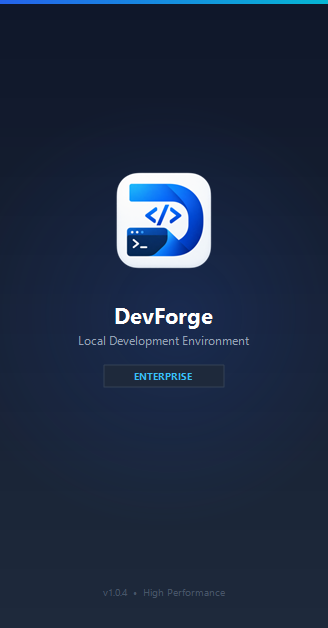

# DevForge

  

  <strong>Fast, Modern, All-In-One Local Web Development Server for Windows</strong>

  
  
  
  

---

## ⚡ Overview

**DevForge** is a lightning-fast, self-contained local web development environment built specifically for Windows developers. It bundles everything you need to build, test, and deploy modern PHP, Node.js, and MySQL applications right on your local machine without the hassle of configuring individual services or dealing with complex VM/Docker overhead.

  

---

## 📦 Download & Quick Install

### [⬇️ Download DevForge v1.0.4 Standalone Installer (.exe)](DevForge-v1.0.4-Setup.exe?raw=true)

> **File:** `DevForge-v1.0.4-Setup.exe` (~175 MB)  
> **Prerequisites:** Windows 10 / 11 (64-bit). Administrator rights are required during setup to configure system ports (80/443/3306) and local hosts.

### Quick Setup Steps
1. Download **`DevForge-v1.0.4-Setup.exe`**.
2. Run the installer and choose your installation directory (default: `C:\DevForge`).
3. Follow the wizard steps to complete the installation.
4. Launch **DevForge** from the Start Menu or Desktop shortcut.
5. Click **Start All Services** and start coding!

---

## 🛠️ Bundled Components & Tech Stack

DevForge comes pre-packaged with production-ready, tuned runtimes and server components:

| Component | Description |
| :--- | :--- |
| **Apache 2.4** | High-performance HTTP/HTTPS web server with mod_rewrite & virtual host support |
| **MySQL 8.0** | Robust, enterprise-grade relational database engine |
| **PHP 8.2 & 8.3** | High-performance PHP fast-CGI runtimes with essential development extensions enabled |
| **Node.js 20 LTS** | Modern JavaScript runtime bundled with npm for frontend tooling |
| **Mailpit** | Ultra-fast local email testing server & web UI for catching and inspecting outgoing mail |
| **phpMyAdmin 5.2** | Full-featured web-based MySQL administration interface |
| **Composer 2** | Dependency manager for PHP pre-configured and globally accessible |

---

## 🌟 Key Features

* **One-Click Control**: Start, stop, or restart individual services or the entire stack with a single click.
* **Modern Windows UI**: Clean, responsive dashboard designed for Windows 10 & 11 with system tray minimization.
* **Automatic Virtual Hosts**: Quickly map local domains (`project.local`) with automatic `hosts` file routing.
* **Local SSL / HTTPS**: Zero-config local certificate support for testing secure web applications.
* **Isolated Environment**: Kept entirely self-contained inside `C:\DevForge` — leaves no messy registry clutter or conflicting background services.
* **Built-in Mail Testing**: Catch every development email in Mailpit without risking sending test emails to real users.

---

## 💻 System Requirements

* **Operating System**: Windows 10 (Version 1903 or later) or Windows 11 (64-bit)
* **Processor**: Intel / AMD 64-bit processor (x64)
* **Memory**: Minimum 4 GB RAM (8 GB or more recommended)
* **Storage**: ~3 GB free disk space for complete runtime environment and database storage

---

## 📄 License & Copyright

Copyright © 2026 **Arindam Makar**. All Rights Reserved.  
DevForge is proprietary software. See the [LICENSE](LICENSE) file for full terms and conditions.