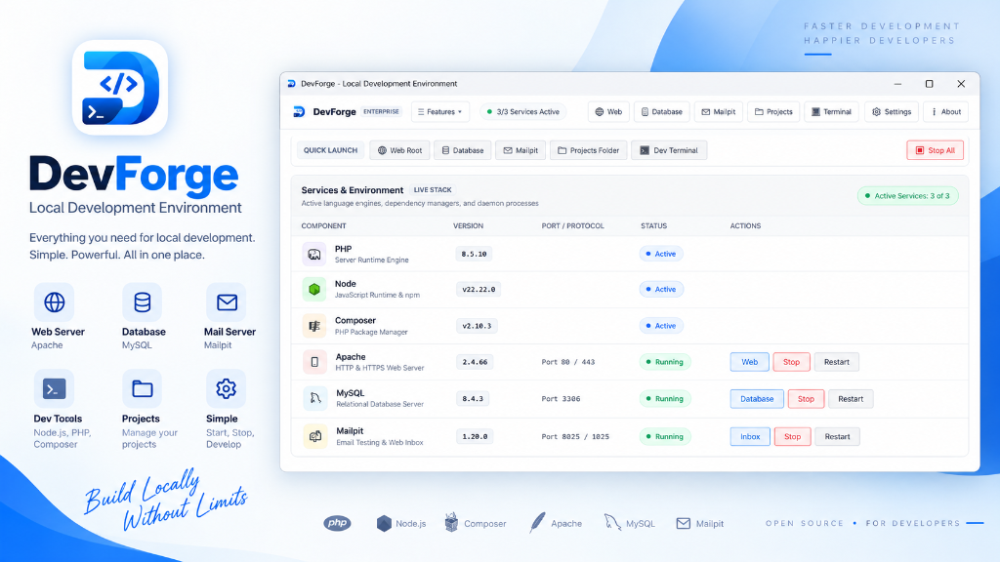

# DevForge - Local Server for Developers

<p align="center">
  
</p>

<p align="center">
  <a href="https://github.com/deadxfire/DevForge-Local-Server-for-Developers/releases"></a>
  
  
  
  <a href="LICENSE"></a>
</p>

---

## ⚡ What is DevForge?

**DevForge** is a modern, blazing-fast, and universal local development environment built specifically for Windows developers. It provides an isolated, portable, and hassle-free server stack for developing PHP, Node.js, and MySQL applications.

DevForge is engineered for performance, stability, and simplicity:
* **No Windows Service Clutter**: DevForge does not permanently register background Windows services. Its built-in service orchestration manages processes cleanly and shuts them down completely when you exit.
* **Isolated & Portable**: Keep your entire development environment self-contained in one directory without scattering files across system folders or polluting the Windows registry.
* **Lightning Fast**: Enjoy near-instant startup times and rapid virtual host resolution.

---

## 📦 Editions & Downloads

DevForge is available in two distinct distributions to suit your workflow:

### 1. Standalone Installer (`.exe`) — Recommended for Most Users
The full all-in-one setup installer pre-bundles all runtimes (Apache, MySQL, PHP, Node.js, Composer, Mailpit, phpMyAdmin) and system prerequisites.

👉 **[⬇️ Download DevForge v1.0.4 Standalone Setup (.exe)](https://github.com/deadxfire/DevForge-Local-Server-for-Developers/releases/download/v1.0.4/DevForge-v1.0.4-Setup.exe)**  
*(Direct high-speed download · ~175 MB · Verified Release Asset)*  
Or view all versions on the **[Releases Page](https://github.com/deadxfire/DevForge-Local-Server-for-Developers/releases)**.

### 2. Portable Edition (This Repository)
This repository contains the **Portable Edition** structure of DevForge.
* Clone or download this repository as a ZIP.
* Launch **`DevForge.exe`** directly from the root folder.
* Add or customize your favorite runtimes inside the `bin/` directory.

---

## 🛠️ Bundled Components & Tech Stack

| Component | Version | Description |
| :--- | :--- | :--- |
| **PHP** | `8.5.10` / `8.2` | Fast-CGI runtimes pre-configured with essential web development extensions |
| **Node.js** | `v22.22.0` LTS | Modern JavaScript runtime bundled with npm and npx |
| **Composer** | `v2.10.3` | Dependency manager for PHP pre-configured and globally accessible |
| **Apache** | `2.4.66` | High-performance HTTP/HTTPS web server with mod_rewrite & virtual host support |
| **MySQL** | `8.4.3` / `8.0` | Enterprise-grade relational database engine with automated data lifecycle |
| **Mailpit** | `1.20.0` | Ultra-fast local email testing server & web UI for catching and inspecting outgoing mail |
| **phpMyAdmin** | `5.2` | Full-featured web-based MySQL administration interface |

---

## 🌟 Key Features

* **Pretty Local URLs**: Automatically map project folders into clean local domains (e.g., `http://myproject.test` instead of `http://localhost/myproject`).
* **Zero-Config Local SSL**: One-click local HTTPS certificates for testing secure web applications.
* **Service Orchestration**: Start, stop, or restart individual services or the entire stack with a single click.
* **System Tray Minimization**: Seamlessly runs in the Windows notification area with quick-access tray menus.
* **Flexible Directory Layout**:
  - `projects/` — Place your web project folders here.
  - `config/` — Apache and MySQL configuration files.
  - `defaults/` — Pristine default configurations and templates.
  - `bin/` — Runtimes for Apache, PHP, MySQL, Node.js, Mailpit, etc.
  - `logs/` — Aggregated server logs.
* **Clean Uninstall**: Because it does not pollute system directories, removing or moving DevForge is as simple as deleting its folder.

---

## 🚀 Quick Start Guide

### Using the Portable Edition:
1. Clone this repository or download the ZIP:
   ```bash
   git clone https://github.com/deadxfire/DevForge-Local-Server-for-Developers.git
   ```
2. Double-click **`DevForge.exe`** in the root directory.
3. Click **Start All Services**.
4. Open your browser and navigate to `http://localhost` to view the DevForge welcome page!

---

## 💻 System Requirements

* **Operating System**: Windows 10 (Version 1903 or later) or Windows 11 (64-bit)
* **Processor**: 64-bit Intel / AMD CPU (x64)
* **Memory**: Minimum 4 GB RAM (8 GB or more recommended)
* **Privileges**: Administrator privileges may be requested when binding standard ports (80/443) or managing virtual hosts.

---

## 🤝 Community & Support

* **Bug Reports**: Found a bug? Open an issue via our [Bug Report Template](https://github.com/deadxfire/DevForge-Local-Server-for-Developers/issues/new?template=bug_report.md).
* **Feature Requests**: Have an idea? Submit a request via our [Feature Request Template](https://github.com/deadxfire/DevForge-Local-Server-for-Developers/issues/new?template=feature_request.md).

---

## 📄 License & Copyright

Copyright © 2026 **Arindam Makar**. All Rights Reserved.  
DevForge and all associated binaries, designs, and documentation are proprietary software. See [LICENSE](LICENSE) for terms.
